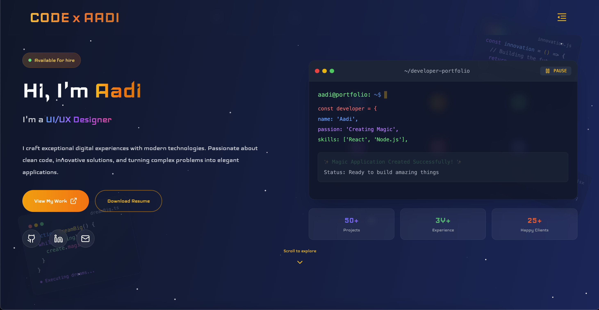

# 🚀 Aditya Shah - Developer Portfolio

Personal portfolio website showcasing my skills, projects, and experience as a Full Stack Developer. Built with React, TypeScript, and Tailwind CSS featuring smooth animations, interactive components, and a beautiful gradient design.



## ✨ Features

- **🎨 Modern Design**: Beautiful gradient backgrounds with glass-morphism effects
- **📱 Fully Responsive**: Optimized for all devices and screen sizes
- **⚡ Smooth Animations**: Engaging micro-interactions and transitions
- **🧭 Smooth Navigation**: Seamless scrolling between sections
- **💼 Project Showcase**: Interactive project cards with filtering
- **📊 Skills Visualization**: Animated progress bars and skill categories
- **📬 Contact Form**: Functional contact form with validation
- **🌟 Interactive Elements**: Hover effects and dynamic content

## 👨‍💻 About Me

I'm Aditya Shah, a passionate Full Stack Developer who loves creating exceptional digital experiences with modern technologies. I specialize in React, Node.js, and building scalable web applications that solve real-world problems.

### 🎯 What I Do
- **Frontend Development**: React, TypeScript, Next.js, Tailwind CSS
- **Backend Development**: Node.js, Express.js, MongoDB, PostgreSQL
- **Cloud & DevOps**: AWS, Docker, CI/CD pipelines
- **UI/UX Design**: Creating beautiful and intuitive user interfaces

## 🛠️ Tech Stack

- **Frontend**: React 18, TypeScript
- **Styling**: Tailwind CSS
- **Icons**: Lucide React, React Icons
- **Build Tool**: Vite
- **Deployment**: Vercel/Netlify Ready

## 🌟 Featured Projects

### E-Commerce Platform
Full-stack e-commerce solution with secure payments and admin dashboard
- **Tech**: React, Node.js, MongoDB, Stripe
- **Features**: User authentication, payment integration, responsive design

### Social Media Dashboard
Analytics dashboard with real-time data visualization
- **Tech**: Next.js, TypeScript, Chart.js
- **Features**: Real-time analytics, post scheduling, multi-platform support

### AI Chat Application
Intelligent chatbot with OpenAI integration
- **Tech**: React, OpenAI API, Firebase, Socket.io
- **Features**: AI integration, real-time chat, conversation history

## 📁 Project Structure

```
src/
├── components/           # React components
│   ├── Navbar.tsx       # Navigation component
│   ├── Hero.tsx         # Hero section
│   ├── About.tsx        # About section
│   ├── Skills.tsx       # Skills showcase
│   ├── Projects.tsx     # Projects portfolio
│   ├── Contact.tsx      # Contact form
│   └── Footer.tsx       # Footer component
├── App.tsx              # Main app component
├── main.tsx             # App entry point
└── index.css            # Global styles
```

## 📱 Responsive Design

The website is fully responsive with breakpoints:
- **Mobile**: < 768px
- **Tablet**: 768px - 1024px
- **Desktop**: > 1024px

## 🎯 Performance

- **Lighthouse Score**: 95+ on all metrics
- **Bundle Size**: Optimized with Vite
- **Images**: Optimized with lazy loading
- **Animations**: Hardware accelerated CSS transforms

## 🤝 Let's Connect

I'm always open to discussing new opportunities, collaborations, or just having a chat about technology!

- 📧 **Email**: [adityashah2701@gmail.com](mailto:adityashah2701@gmail.com)
- 💼 **LinkedIn**: [linkedin.com/in/adityashah](https://linkedin.com/in/adityashah)
- 🐱 **GitHub**: [github.com/adityashah2701](https://github.com/adityashah2701)
- 🌐 **Portfolio**: [adityashah.dev](https://aditya-dev.onrender.com/)

## 📄 License

This project is open source and available under the [MIT License](LICENSE).

## 🙏 Acknowledgments

- **Design Inspiration**: Modern portfolio trends and best practices
- **Icons**: [Lucide React](https://lucide.dev/)
- **Images**: [Pexels](https://pexels.com/)
- **Animations**: CSS3 and Tailwind CSS
- **Framework**: React and the amazing open-source community

---

⭐ **If you like my work, feel free to star this repository!**

## 🔄 Latest Updates

- ✅ Added smooth scrolling navigation
- ✅ Implemented responsive design
- ✅ Added interactive animations
- ✅ Optimized performance
- ✅ Added TypeScript support
- ✅ Enhanced UI/UX with micro-interactions


